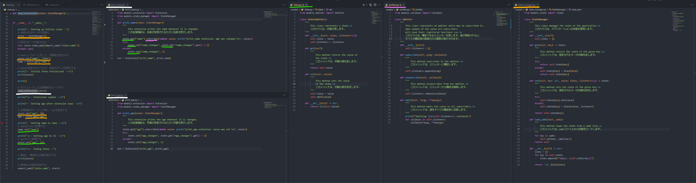

# Extensible-Application-Demo

Current Output For Demonstration Purposes:

Run #1

-- Setting up initial state --
-- Initial State Initialised --

name: John

-- Loading Extensions --
-- Loading print_age.py --
Emitting 1 callbacks
print_age extension: value was set to 1
-- Loading print_name.py --
Emitting 1 callbacks
print_age extension: value was set to 1

-- Extensions Loaded --

-- Setting age after extension load --

Emitting 1 callbacks
print_age extension: value was set to 30
-- Setting name to Jane --

Emitting 1 callbacks
print_name extension: age was changed to Jane

-- Setting age to 31 --

Emitting 1 callbacks
print_age extension: value was set to 31

-- Ending State --
name: Jane
age: 31
age_changes: 1
name_changes: 1

Run #2

-- Setting up initial state --
Emitting 0 callbacks
-- Initial State Initialised --

age: 31
age_changes: 1
name: John
name_changes: 1

-- Loading Extensions --
-- Loading print_age.py --
Emitting 1 callbacks
print_age extension: value was set to 2
-- Loading print_name.py --
Emitting 2 callbacks
print_age extension: value was set to 2
print_name extension: age was changed to 2

-- Extensions Loaded --

-- Setting age after extension load --

Emitting 2 callbacks
print_age extension: value was set to 30
print_name extension: age was changed to 30
-- Setting name to Jane --

Emitting 2 callbacks
print_age extension: value was set to Jane
print_name extension: age was changed to Jane

-- Setting age to 31 --

Emitting 2 callbacks
print_age extension: value was set to 31
print_name extension: age was changed to 31

-- Ending State --
age: 31
age_changes: 2
name: Jane
name_changes: 2